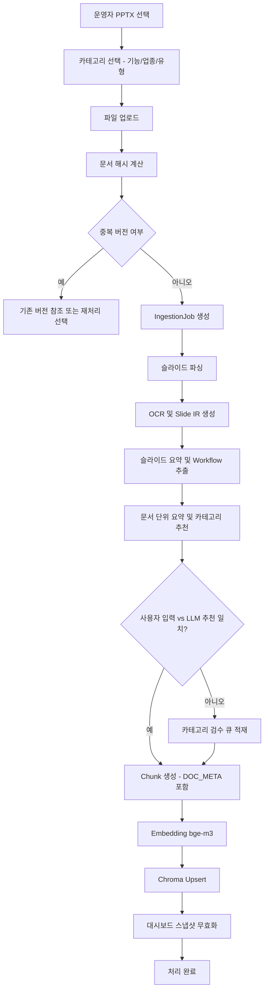
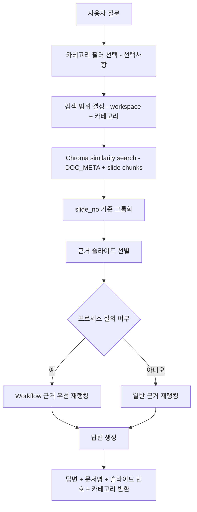
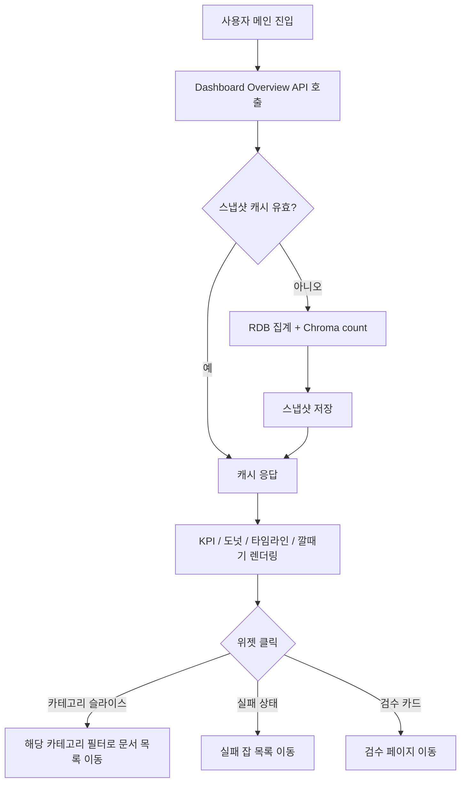

# 사용자 흐름

## 업로드 흐름



## 질의 흐름



## 대시보드 흐름



## 예외 흐름

- OCR 실패: OCR chunk 없이 summary/detail만 적재
- 임베딩 실패: 재시도 큐로 이동
- Chroma upsert 실패: job 상태 `PARTIAL_FAILED`
- 질의 결과 부족: "관련 슬라이드를 찾지 못함"과 함께 유사도 낮은 후보 비노출

## 사용자 응답 포맷 원칙

질의 응답은 최소한 아래 구조를 만족해야 한다.

```json
{
  "answer": "질문에 대한 요약 답변",
  "evidences": [
    {
      "documentName": "sample.pptx",
      "slideNo": 7,
      "snippet": "매출 성장률이 2024년에 가장 높게 나타남",
      "score": 0.91,
      "categories": {
        "function": ["영업"],
        "industry": ["제조"],
        "docType": "보고서"
      }
    }
  ]
}
```

## 페이지 번호 정확도 원칙

- PowerPoint는 일반적으로 슬라이드 번호 개념이므로 내부 시스템 필드는 `slide_no`로 통일한다.
- 사용자 메시지에서는 `7페이지` 또는 `7번 슬라이드`로 변환 가능하지만, API 내부 명칭은 하나로 고정한다.
