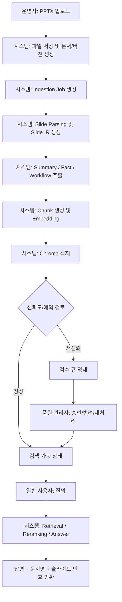
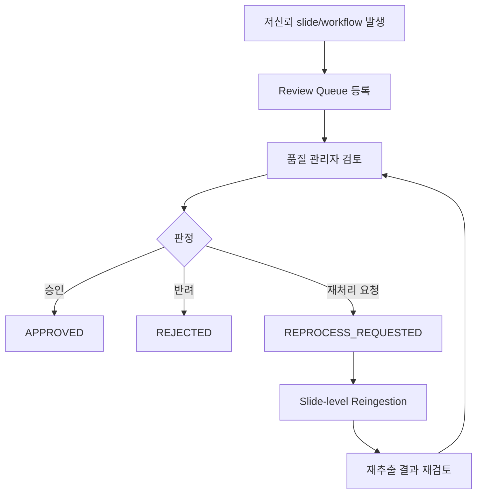

# 업무 순서 설계

## 목적

이 문서는 PPTX RAG 서비스가 실제 운영에서 어떤 순서로 움직이는지, 누가 어떤 입력을 받아 어떤 결과를 만들고 어디서 예외가 발생하는지를 한 번에 파악하기 위해 작성한다.

## 다루는 범위

- PPTX 업로드
- 인덱싱 배치 실행
- 추출 결과 검수
- 사용자 질의
- 재처리 및 운영 보정

## 주요 역할

| 역할 | 설명 |
|---|---|
| 운영자 | PPTX 업로드, 상태 확인, 재처리 요청 |
| 시스템 | 파싱, 추출, 임베딩, Chroma 적재, 질의 응답 |
| 품질 관리자 | 저신뢰 추출 결과 검수, 승인/반려 |
| 일반 사용자 | 질의 입력, 근거 슬라이드 확인 |
| 관리자 | 문서 비활성화, 인덱스 정리, 정책 변경 |

## 전체 업무 흐름

## 메인 업무 순서

| Step | Role | Trigger/Input | Action | Output | Decision/Exception |
|---|---|---|---|---|---|
| 1 | 운영자 | 새 PPTX 파일 | workspace 선택 후 업로드 | 문서/버전 생성 요청 | 확장자/용량 오류 시 업로드 거절 |
| 2 | 시스템 | 업로드 요청 | 파일 저장, 해시 계산, 중복 판정 | 저장 경로, source hash | 중복 정책에 따라 skip/new-version/force-reingest |
| 3 | 시스템 | 저장 완료 | ingestion job 생성 | `QUEUED` 상태 job | job 생성 실패 시 문서 상태 점검 필요 |
| 4 | 시스템 | job 실행 | 슬라이드 파싱, 텍스트/표/도형/노트 추출 | slide metadata, slide IR | 손상된 PPTX면 `FAILED` |
| 5 | 시스템 | slide IR | summary, facts, workflow 구조 추출 | semantic extraction result | workflow confidence 낮으면 low-confidence 표시 |
| 6 | 시스템 | semantic result | raw/summary/fact/workflow chunk 조립 | retrieval chunk 세트 | JSON 파싱 실패 시 raw-only fallback |
| 7 | 시스템 | chunk 세트 | embedding 생성 후 Chroma upsert | 검색 가능한 vector 데이터 | 일부 실패 시 `PARTIAL_FAILED` |
| 8 | 시스템 | extraction/confidence | 검수 필요 여부 판정 | `NOT_REQUIRED` 또는 `PENDING_REVIEW` | workflow/ocr 저신뢰는 검수 큐 이동 |
| 9 | 품질 관리자 | 검수 큐 항목 | 원문과 semantic 결과 비교 후 승인/반려 | `APPROVED` 또는 `REJECTED` | 반려 시 slide-level 재처리 요청 가능 |
| 10 | 일반 사용자 | 자연어 질문 | query type 분류, retrieval, reranking | evidence 후보 | 근거 부족 시 no-answer |
| 11 | 시스템 | 상위 evidence | grounded answer 생성 | 답변, 문서명, slide no | evidence 충돌 시 답변 보류 |
| 12 | 운영자/관리자 | 오류/정책 변경 | 재처리, 비활성화, purge 실행 | 수정된 검색 상태 | prompt/model 변경 시 대량 재처리 |

## 업로드 및 인덱싱 업무 흐름

### 시작 조건

- 운영자가 업로드 권한을 가지고 있어야 한다.
- 대상 workspace가 활성 상태여야 한다.

### 종료 조건

- 문서가 `검색 가능` 상태가 되거나
- 실패/검수대기 상태로 운영자 개입이 필요한 상태가 된다.

### 상세 순서

1. 운영자가 파일을 업로드한다.
2. 시스템이 파일을 저장하고 해시를 계산한다.
3. 중복 정책을 적용한다.
4. 새 버전이 필요하면 ingestion job을 만든다.
5. 워커가 슬라이드를 파싱하고 `slide IR`를 만든다.
6. LLM semantic extraction으로 `summary`, `facts`, `workflow`를 만든다.
7. chunk를 만들고 임베딩 후 Chroma에 적재한다.
8. confidence와 추출 유형을 기준으로 review candidate를 만든다.
9. 검수가 필요 없으면 바로 검색 가능 상태로 전환한다.

## 질의 및 근거 반환 업무 흐름

### 시작 조건

- 검색 가능한 문서가 하나 이상 존재해야 한다.
- 사용자가 workspace 범위에 대한 조회 권한을 가져야 한다.

### 종료 조건

- 답변과 근거 슬라이드가 반환되거나
- no-answer가 반환된다.

### 상세 순서

1. 사용자가 질문을 입력한다.
2. 시스템이 query type을 분류한다.
3. 분류 결과에 따라 우선 chunk type을 선택한다.
4. Chroma에서 top-k chunk를 검색한다.
5. slide 기준으로 그룹화하고 재랭킹한다.
6. evidence를 선택한다.
7. evidence가 충분하면 grounded answer를 생성한다.
8. 답변에 `documentName`, `slideNo`, `snippet`을 포함해 반환한다.
9. 근거가 약하거나 충돌하면 no-answer 또는 보수 응답을 반환한다.

## 검수 업무 흐름

## 역할별 업무 순서

### 운영자

1. 문서를 업로드한다.
2. 상태를 확인한다.
3. 실패 건이나 반려 건에 대해 재처리를 요청한다.
4. 필요 시 특정 문서를 비활성화한다.

### 품질 관리자

1. 검수 큐에서 우선순위 높은 항목을 확인한다.
2. 썸네일, raw text, summary, facts, workflow를 비교한다.
3. 승인, 반려, workflow 비활성화, 재처리 요청 중 하나를 선택한다.

### 일반 사용자

1. 질문을 입력한다.
2. 답변을 본다.
3. 관련 문서와 슬라이드 번호를 확인한다.
4. 필요 시 다른 문서 범위로 다시 질문한다.

## 주요 의사결정 지점

| 지점 | 판단 기준 | 결과 |
|---|---|---|
| 중복 업로드 판정 | source hash, 정책 설정 | skip / new version / force reingest |
| workflow 적재 여부 | `workflow confidence` | 적재 / 가중치 감소 / 비적재 |
| 검수 큐 이동 여부 | overall confidence, OCR 비중, exception edge | `PENDING_REVIEW` 또는 자동 통과 |
| 질의 응답 가능 여부 | top slide score, evidence count, grounded confidence | answer / no-answer |
| 재처리 범위 | 오류 위치, 정책 변경 범위 | slide / document version / workspace |

## 예외 및 되돌림 흐름

| 상황 | 기본 처리 |
|---|---|
| 파일 저장 실패 | 업로드 실패 반환, 버전 생성 중단 |
| 파싱 실패 | ingestion job `FAILED`, 운영자 확인 필요 |
| OCR 실패 | OCR 없이 계속 진행, low-confidence 가능 |
| workflow 추출 실패 | summary/fact만 적재 |
| Chroma 일부 적재 실패 | `PARTIAL_FAILED`, 재시도 큐 이동 |
| evidence 충돌 | 보수 응답 또는 no-answer |
| 검수 반려 | slide-level 재처리 또는 비노출 처리 |

## 운영 메모

- 이 서비스의 핵심 비즈니스 순서는 `업로드 -> 추출 -> 검수 -> 검색 -> 재처리`다.
- 실제 검색 품질은 retrieval보다도 `추출 결과가 어느 단계에서 승인 가능한 상태가 되느냐`에 크게 좌우된다.
- 따라서 운영 문맥에서는 `질의 응답 시스템`이면서 동시에 `문서 추출 검수 시스템`으로 이해하는 편이 맞다.
